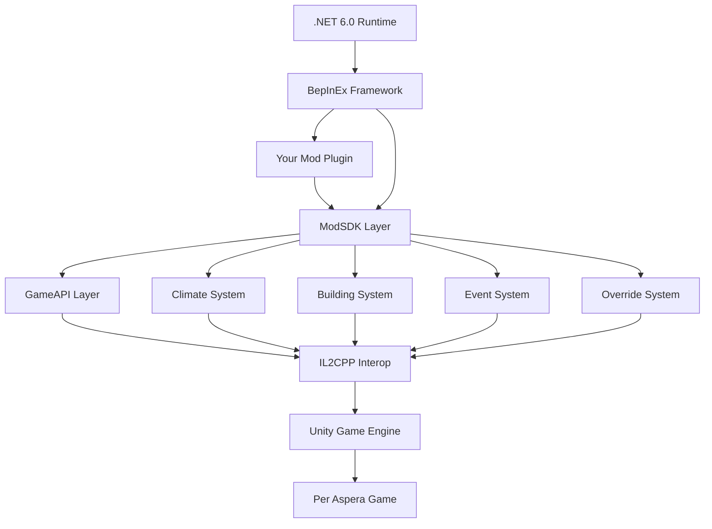
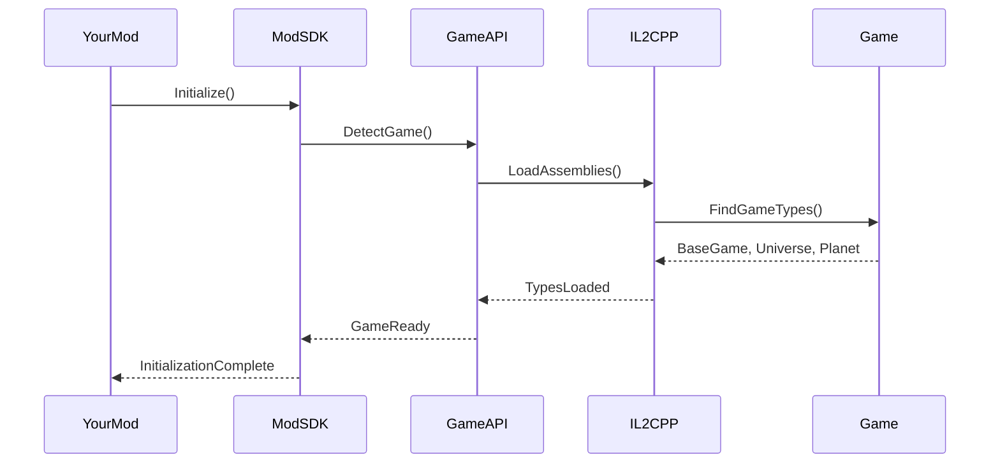
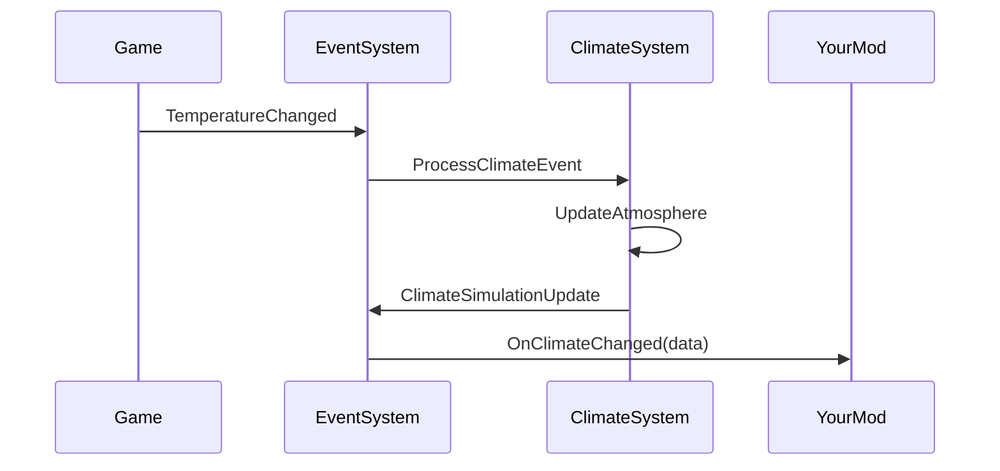

# Architecture Overview

Understanding the PerAspera SDK structure, design principles, and component relationships.

## 🏗️ SDK Architecture

The PerAspera SDK is built on a modular architecture that provides multiple layers of abstraction over the Per Aspera game systems.



## 📦 Core Components

### 1. ModSDK Layer (Your Entry Point)

The main interface that provides simplified access to all SDK features.

**Key Responsibilities:**
- Plugin initialization and lifecycle management
- Unified event system coordination
- High-level API access
- Error handling and logging
- Auto-configuration and game detection

**Usage Pattern:**
```csharp
public class MyMod : BasePlugin
{
    public override void Load()
    {
        // Single initialization call
        ModSDK.Initialize(this);
        
        // Everything else is available
        ModSDK.Events.Subscribe("climate.changed", OnClimateChanged);
        ModSDK.Universe.GetCurrentSol();
        ModSDK.Climate.GetTemperature();
    }
}
```

### 2. GameAPI Layer (Direct Game Access)

Low-level access to Per Aspera's internal systems through IL2CPP interop.

**Core Modules:**

#### GameAPI.BaseGame
- Main game singleton access
- Game state management
- Core game loop integration

```csharp
// Access game instance
var baseGame = GameAPI.BaseGame;
if (baseGame.IsGameLoaded)
{
    // Game is ready for interaction
}
```

#### GameAPI.Universe
- Universe/galaxy management
- Planet and faction access
- Time and celestial mechanics

```csharp
// Get current Martian sol
int currentSol = GameAPI.Universe.GetMartianSol();

// Access planet data
var planet = GameAPI.Universe.GetPlanet();
```

#### GameAPI.Planet
- Specific planet instance access
- Surface, atmosphere, and resource data
- Building and infrastructure management

```csharp
// Get planet climate data
var climateData = GameAPI.Planet.GetClimateData();
var temperature = climateData.Temperature;
```

### 3. Climate System (Atmospheric Simulation)

Advanced atmospheric and climate simulation system.

**Features:**
- Real-time atmospheric composition tracking
- Temperature and pressure calculations
- Greenhouse effect simulation
- Terraforming progress monitoring
- Custom gas and atmospheric effects

**Architecture:**
```csharp
ClimateSimulation
├── AtmosphericComposition    // Gas mixtures and ratios
├── TemperatureModel         // Heat transfer and retention
├── PressureSystem          // Atmospheric pressure dynamics
├── GreenhouseCalculator    // Greenhouse gas effects
└── TerraformingMetrics     // Progress tracking
```

### 4. Building System (Infrastructure Integration)

Monitor and interact with Mars infrastructure.

**Capabilities:**
- Building lifecycle monitoring
- Production and resource tracking
- Atmospheric impact calculation
- Power and efficiency analysis

```csharp
BuildingSystem
├── ProductionMonitor       // Track resource production
├── AtmosphereImpact       // Building atmospheric effects
├── LifecycleManager       // Construction/destruction events
└── EfficiencyAnalyzer     // Performance metrics
```

### 5. Event System (Unified Communication)

Centralized event handling for all game activities.

**Event Categories:**
- **Game Events**: State changes, loading, initialization
- **Climate Events**: Temperature, pressure, atmospheric changes
- **Building Events**: Construction, production, efficiency
- **Player Events**: Actions, commands, interactions
- **System Events**: SDK lifecycle, errors, diagnostics

### 6. Override System (Dynamic Modification)

Runtime modification of game values and behaviors.

**Capabilities:**
- Real-time value overrides
- Conditional modifications
- Temporary and permanent changes
- Conflict resolution between mods

## 🔄 Data Flow Architecture

### 1. Initialization Flow



### 2. Event Processing Flow



## 🧩 Component Interactions

### ModSDK ↔ GameAPI
- **Purpose**: Abstract complex IL2CPP interactions
- **Pattern**: Facade pattern - simplified interface over complex subsystem
- **Error Handling**: ModSDK wraps GameAPI exceptions with user-friendly messages

### GameAPI ↔ IL2CPP Interop
- **Purpose**: Safe access to Unity IL2CPP compiled game code
- **Pattern**: Adapter pattern - translates between .NET and IL2CPP
- **Safety**: Null checking, type validation, graceful fallbacks

### Event System ↔ All Components
- **Purpose**: Decoupled communication between components
- **Pattern**: Observer pattern with event aggregation
- **Performance**: Asynchronous processing, batching for high-frequency events

### Climate System ↔ Building System
- **Purpose**: Track building impacts on planetary atmosphere
- **Pattern**: Strategy pattern - different buildings have different atmospheric effects
- **Integration**: Real-time updates as buildings are constructed/destroyed

## 🏛️ Design Principles

### 1. **Layered Architecture**
Each layer has a specific responsibility and only interacts with adjacent layers.

### 2. **Fail-Safe Design**
- Graceful degradation when game systems are unavailable
- Comprehensive error handling with recovery mechanisms
- Extensive validation and safety checks

### 3. **Performance First**
- Minimal allocation during gameplay
- Efficient caching strategies
- Asynchronous operations where possible
- Smart initialization (only when needed)

### 4. **Mod Compatibility**
- Non-invasive integration techniques
- Conflict resolution systems
- Shared state management
- Event priority systems

### 5. **Developer Experience**
- Intuitive APIs with sensible defaults
- Comprehensive documentation and examples
- Intelligent auto-configuration
- Rich debugging and logging support

## 🔧 IL2CPP Integration Strategy

### Challenge: Unity IL2CPP Compilation
Per Aspera uses Unity's IL2CPP compiler, which converts C# to C++ for performance. This creates challenges for modding:

- **No Reflection**: Standard .NET reflection doesn't work
- **Type Safety**: Direct pointer access risks crashes
- **Name Mangling**: C++ name mangling obscures original names

### Solution: Mirror System
The SDK implements a "Mirror" system that creates safe wrappers around IL2CPP types:

```csharp
// Instead of direct IL2CPP access (dangerous):
BaseGame_IL2CPP.instance.GetCurrentTemperature();  // ❌ Can crash

// Use Mirror wrapper (safe):
GameAPI.BaseGame.GetCurrentTemperature();  // ✅ Safe with error handling
```

**Mirror Benefits:**
- **Type Safety**: Null checking and validation
- **Error Handling**: Graceful failures instead of crashes
- **API Stability**: Consistent interface across game versions
- **Documentation**: Rich IntelliSense and documentation

## 🚀 Performance Architecture

### Memory Management
```csharp
// Object pooling for frequent allocations
private static readonly ObjectPool<ClimateData> _climatePool = 
    new ObjectPool<ClimateData>();

// Efficient data structures
private static readonly Dictionary<string, EventHandler> _eventCache = 
    new Dictionary<string, EventHandler>(StringComparer.OrdinalIgnoreCase);
```

### Caching Strategy
- **Game State**: Cache frequently accessed game objects
- **Reflection Data**: Pre-compute and cache IL2CPP type information
- **Event Handlers**: Compile and cache event handler delegates
- **Configuration**: Cache parsed configuration data

### Asynchronous Operations
```csharp
// Non-blocking initialization
public static async Task InitializeAsync()
{
    await Task.Run(() => LoadGameAssemblies());
    await Task.Run(() => DiscoverGameTypes());
    await Task.Run(() => InitializeSubsystems());
}
```

## 🔐 Security & Safety

### Safe IL2CPP Access
- All IL2CPP calls wrapped in try-catch blocks
- Null pointer validation before dereferencing
- Type checking before casting
- Graceful fallbacks for missing methods/fields

### Mod Isolation
- Separate AppDomains for mod code (where possible)
- Resource quotas to prevent runaway mods
- Error isolation - one mod failure doesn't crash others

### Game State Protection
- Read-only access by default
- Explicit permission required for state modification
- Validation of all state changes
- Rollback mechanisms for critical operations

## 📈 Extensibility Architecture

### Plugin Architecture
```csharp
public interface ISDKExtension
{
    string Name { get; }
    Version Version { get; }
    void Initialize(ISDKContext context);
    void Shutdown();
}

// Register custom extensions
ModSDK.RegisterExtension(new MyCustomSystem());
```

### Event Extension Points
```csharp
// Custom event types
ModSDK.Events.RegisterEventType<MyCustomEventData>("mycustom.event");

// Custom event processors
ModSDK.Events.RegisterProcessor("climate.*", new MyClimateProcessor());
```

### Override Extension Points
```csharp
// Custom override providers
ModSDK.Overrides.RegisterProvider("mymod.building.*", new MyBuildingOverrides());

// Custom value calculators
ModSDK.Overrides.RegisterCalculator("temperature.greenhouse", 
    (original, context) => original * GetMyGreenhouseMultiplier(context));
```

This architecture provides a solid foundation for creating sophisticated Per Aspera mods while maintaining performance, safety, and compatibility across the modding ecosystem.

Ready to dive deeper? Check out our [API Reference](API-Reference.md) for detailed information about each component.